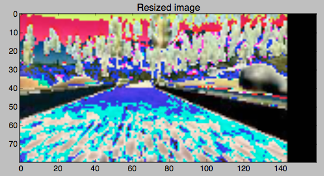
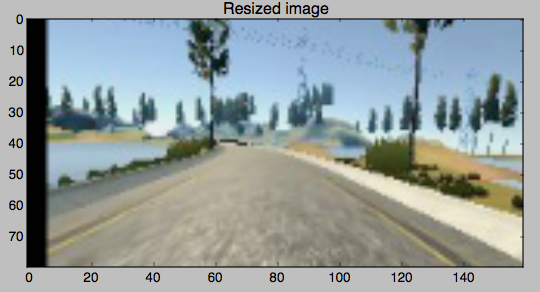

**<u>Behavioral Cloning Project</u>**

**<u>Mandar Joshi, November Cohort</u>**

## Summary

The video below shows the results of cloning driving behavior solely
based on learning through camera data from 3 cameras (left, center and
right) in front of the car in the simulated environment. What follows is
a description of the data, data augmentation, neural network
description.

## 

Link to video: <https://www.youtube.com/watch?v=75uIQI34ikI>

## Model Architecture

The model is an implementation in Keras based on Nvidia’s CNN model with
some variations in the fully connected layer and the input layers.

Shown below is the diagram of the training system.

Shown below is the architecture of the Neural Network

Find a detailed description of the Nvidia model –

<https://devblogs.nvidia.com/parallelforall/deep-learning-self-driving-cars/>

## Data

Training data (provided by Udacity) consisted of individual frames
(~8000) from a video of a car being driven in a simulated environment
with each frame being annotated with the cars steering angle, throttle
and speed at that instant.

The same data was used to create augmented data for training to ensure
that autonomous driving works under different conditions of light, road,
environment, etc. However, before augmentation the images were
preprocessed through normalization, cropping for region-of-interest,
resize.

### Data Preprocessing

- Image normalization: Image has been normalized in the range -1 to 1

- Region of interest/cropping: the top and bottom 30 pixels are removed
  from the image. The top does not contribute in any meaningful way to
  the driving model and the bottom part shows the hood of the car in
  different locations based on if the image is from the
  center/left/right camera. This must be removed so that it does not
  factor in the learning when using image augmentation (which is used to
  train to keep the car within the lanes),

- Resize image: The images were used in their original size of 160x320x3
  for all pre-processing/processing and eventually resized by a factor
  of 2 in terms of the height and width (80x160x3). This does not seem
  to have made any difference to the training quality.

### 

### Data Augmentation

Each augmented image was a result of the following augmentations applied
to an image based on generated probabilities in img_aug_probs(). These
generated probabilities would determine the type of camera image to pick
(left, right, center) and the type of augmentation applied. At the end
you would get an augmented image.

- Brighten/Darken: The image would be brightened or darkened based on
  randomly generated value from a normal distribution. (See below for
  examples)

- Flipped: The image would be flipped or not depending on a randomly
  generated integer 0 or 1. The steering angle would be adjusted
  accordingly. (See below for examples)

- Shift: The image would be shifted based on the values generated for
  width shift and height shift. The steering angle would be adjusted
  accordingly. (Red. Inspired by Vivek Yadav blog on behavioral learning
  in the Dec cohort) (See below for examples)

## Training

### Phases

- The training was divided into two main parts. The idea was to train
  the first phase using given data and <u>fine-tuning</u> the model in
  phase 2 by generating and training on augmented data.

  - Phase 1: In the first phase the data was largely used unaltered to
    train the model. The only data that was generated was to use flipped
    images (and steering angles) to eliminate the skew in the data that
    results because of more left turns than right turns on the track.
    (data_generator_gen() & load_data_gen())

  - Phase 2: In this phase the model was trained using augmented data.
    The details of the data augmentation performed are listed above.
    (data_generator_augmented(), load_data_augmented())

- Fit_generator, Epochs, batch_size, etc.

  - Keras fit_generator (that makes use of python generators) was
    required to ensure that there is no need to load the entire data in
    memory which will result in running out of memory.

  - A batch_size of 64 was used

  - Phase 1 used 6 epochs each to train the model with center, left,
    right and flipped data. 6400 samples per epoch.

  - Phase 2 generated augmented data on the fly based on generated
    probabilities to select the type and extent of augmentation (ref:
    img_aug_probs())

Example 1:

Example2:

Example 3:

